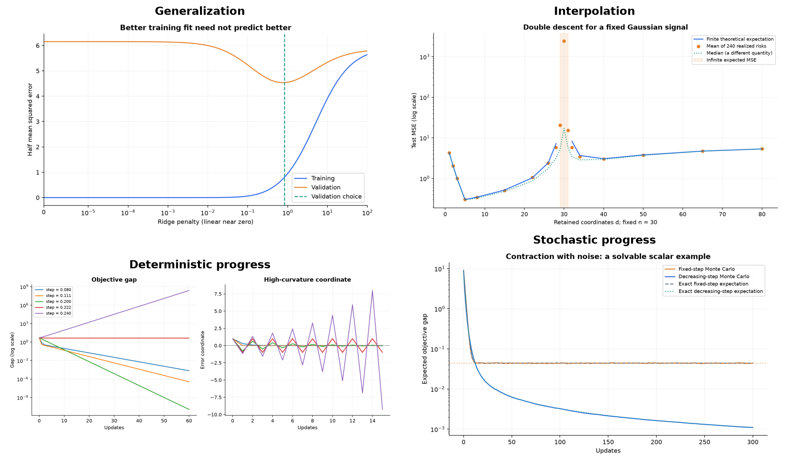

# Learning Theory → Optimization

**A self-study field guide to generalization, gradient methods, and stochastic approximation.**

Read the mathematics, reconstruct the argument, solve a small problem, and test the idea in code. These English notes turn a two-lecture course into a connected learning path. Each chapter explains what problem a result solves, why its assumptions matter, and how to use it.



## Start here

1. Read the [study map](notes/00-study-map.md) and [notation](notes/notation.md).
2. Work through [one scalar gradient-descent problem](exercises/worked-example.md).
3. Follow the chapters below. Attempt the checkpoint before opening its solution.
4. Run a lab, explain what its plot does **and does not** establish, and record evidence in the [learning ledger](study/LEARNING_LOG.md).

No private conversations, question transcripts, personal evaluations, or identifying local paths are part of this repository. The public learning record consists of topics, derivations, practice milestones, and explicitly unverified skills.

## Reading path

| Chapter | The question it answers | Source coverage |
|---|---|---|
| [00 · Study map](notes/00-study-map.md) | How do the results fit together? | Whole course |
| [01 · Risk and representation](notes/01-risk-and-representation.md) | What are we minimizing, and what do we actually want? | §§1.1–1.3 |
| [02 · Capacity, validation, and ridge](notes/02-capacity-and-ridge.md) | Why can a better fit predict worse? | §1.4 |
| [03 · Interpolation and double descent](notes/03-double-descent.md) | How can more parameters help after interpolation? | §1.5 |
| [04 · Geometry and exact GD](notes/04-geometry-and-gd.md) | Which step sizes shrink the error? | §2.1 |
| [05 · General GD proofs](notes/05-gd-proof-patterns.md) | Where do geometric and inverse-time rates come from? | §§2.2–2.3 |
| [06 · Stochastic gradient descent](notes/06-sgd.md) | What changes when the gradient is noisy? | §2.4 |
| [07 · Uncertainty and averaging](notes/07-asymptotic-uncertainty.md) | What does a distributional limit tell us beyond an error bound? | §2.5 |
| [08 · Momentum](notes/08-momentum.md) | Why does remembering past motion sometimes accelerate optimization? | §2.6 |
| [09 · Adam and preconditioning](notes/09-adam.md) | Which parts of adaptive optimization can we actually prove? | §2.7 |
| [10 · Probability toolkit](notes/10-probability.md) | How do convergence modes, stochastic orders, and the delta method work? | Appendix A |

These opening lectures concern supervised learning and optimization. They are prerequisites for deep learning and reinforcement learning; this repository does **not** claim to teach a full neural-network or reinforcement-learning curriculum.

## Practice and reproduce

- [Worked example: from a derivative to a convergence proof](exercises/worked-example.md)
- [Problem set with hints](exercises/problems.md) · [Complete solutions](exercises/solutions.md)
- [Proof selection guide](study/PROOF_PLAYBOOK.md) · [Rate comparison](study/RATE_SHEET.md)
- [Experiments and interpretation](labs/README.md)
- [Technical qualifications and corrections](notes/precision-notes.md)

```bash
python3 -m venv .venv
source .venv/bin/activate
python -m pip install -r requirements.txt
python tools/check_repository.py
python -m unittest discover -s tests -v
python labs/run_all.py
```

Use Python 3.12, the version used for the recorded run and configured in CI. Experiments use NumPy and Matplotlib, synthetic data, and fixed random seeds. The commands write plots and machine-readable measurements to `assets/` and `labs/results/`. See [the reproducibility report](labs/RESULTS.md) for measured results, runtime versions, and limitations. Numerical checks supplement proofs; they do not prove universal convergence claims.

## Learning record and scope

The documented reading sequence reaches **§2.4**. Chapters covering §§2.5–2.7 and the probability appendix are prepared as onward study material. Reading coverage is not a claim of independent mastery or completed coursework. The [ledger](study/LEARNING_LOG.md) keeps those distinctions visible and provides a reusable progress template.

## Source, attribution, and reuse

The [original lecture PDF](reference/lecture_note2.pdf), *Deep Learning and Reinforcement Learning: Lecture notes — Lectures 1–2 with Probability Appendix*, is included with redistribution permission confirmed by the repository maintainer. Its author and institution are not identified in the supplied copy. See [source provenance and reading references](SOURCES.md) and the [section map](reference/SECTION_MAP.md).

This companion is an independently written explanation, not an official course edition, verbatim translation, or set of official homework answers. New prose, exercises, code, and generated figures are provided under the [MIT License](LICENSE). The original PDF is explicitly excluded from that license; see [its rights notice](reference/README.md). References retain their own rights.

Contributions should improve understanding and preserve assumptions. See [CONTRIBUTING.md](CONTRIBUTING.md) and the [validation record](VALIDATION.md). To publish your copy, follow [PUBLISHING.md](PUBLISHING.md).
