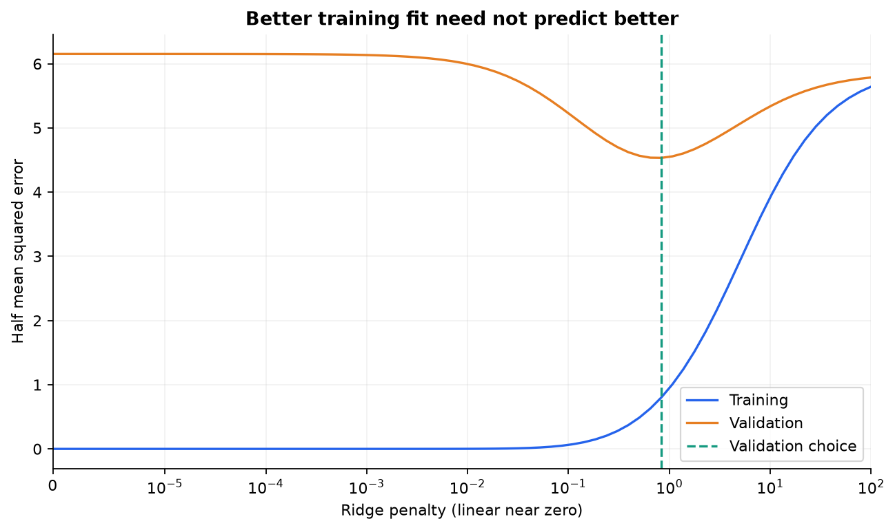
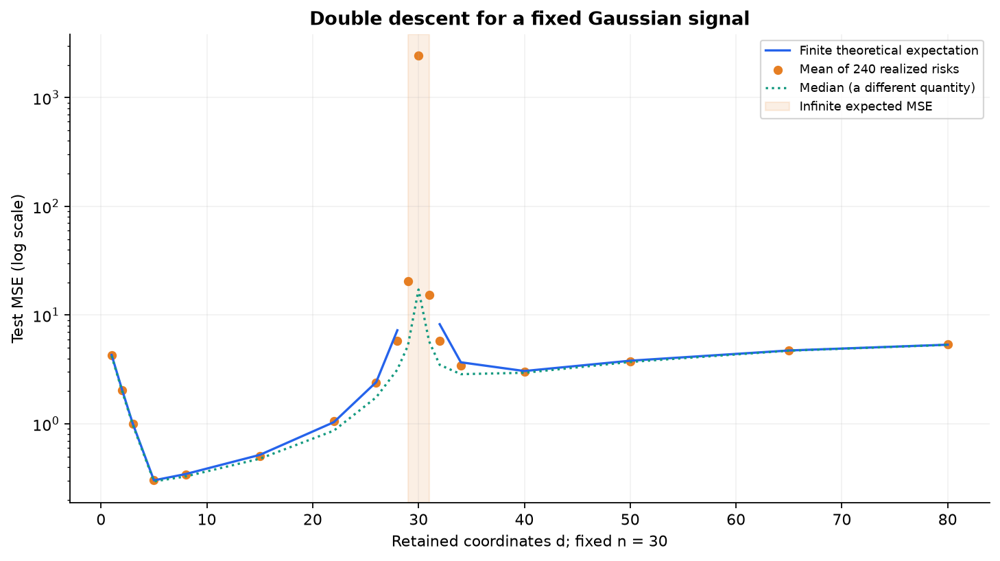
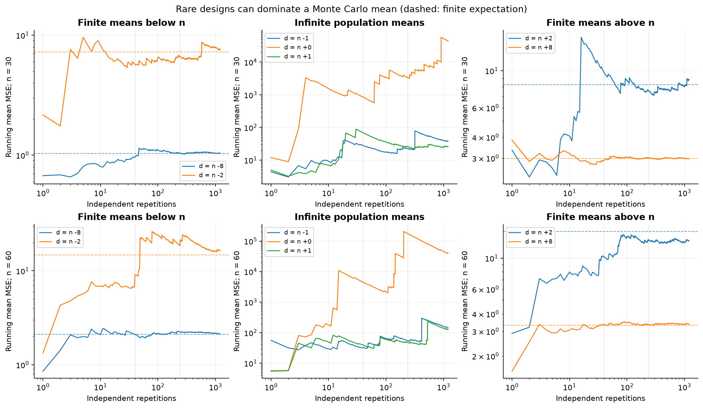
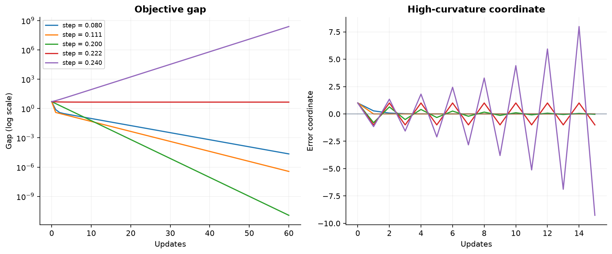
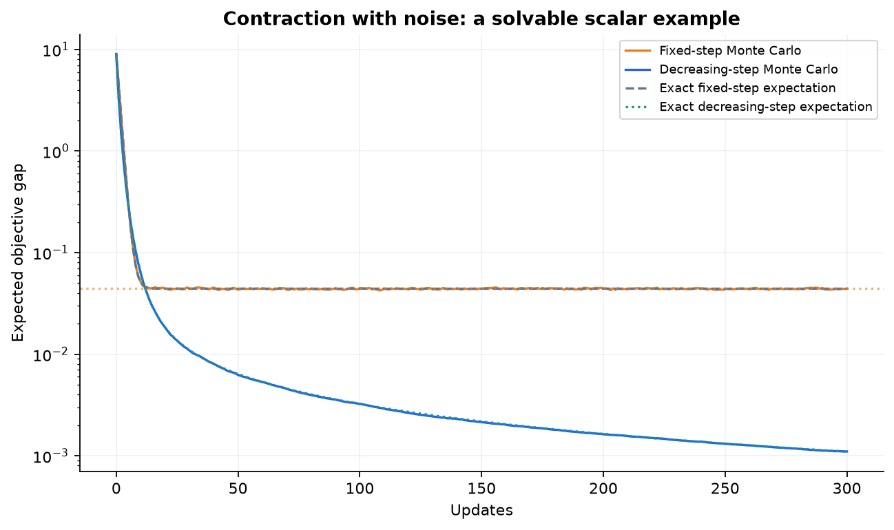
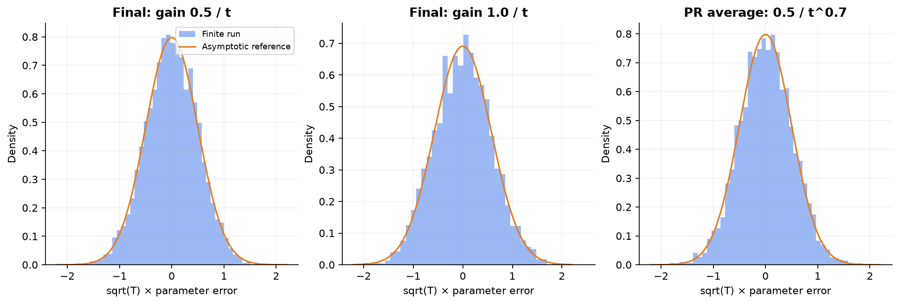

# Reproducible experiments

[Home](../README.md) · [Recorded results](RESULTS.md)

Run `python labs/run_all.py` from the repository root after installing `requirements.txt`. It generates five experiments and a double-descent tail diagnostic in one deterministic-seed run, writes CSV measurements and JSON metadata under `labs/results/`, and regenerates this edition's plots. No external dataset, network request, API key, or original PDF is needed by the code.

## 1. Ridge and selection

The signal has five nonzero coefficients and independent Gaussian observation noise. Training and validation are separate draws. The zero-penalty fit interpolates because there are more coordinates than training examples. A validation sweep selects a penalty; test performance is calculated only after that selection is frozen. This experiment illustrates the distinction between the fitting objective and selection criterion, not a universal optimal penalty.

Change the noise scale or the number of observations and explain why the selected penalty may change. Do not select using the reported test loss.

## 2. Fixed-signal double descent

Each repetition draws one full design and retains increasing prefixes of its columns. The true coefficient vector and sample size stay fixed. Conditional test risk is evaluated analytically as noise plus omitted energy plus squared coefficient error, avoiding a second layer of test-sample Monte Carlo noise.

The blue line is the finite theoretical expectation. Critical dimensions are shaded and the curve is broken there. Orange points are means of finitely many realized risks; the dotted median estimates a different population quantity. The mean can be dominated by rare nearly singular designs. Re-running with more repetitions near interpolation is not guaranteed to stabilize a nonexistent finite expectation.

### Follow the tail, not only the curve

The additional diagnostic fixes the same signal/noise, compares n = 30 and 60, and follows d − n = −8, −2, −1, 0, 1, 2, 8 through 1,200 independent repetitions per sample size. Dashed lines are finite theoretical expectations. The middle panels intentionally have no finite target. Repetition budgets 40, 240, and 1,200 are nested prefixes of each stream; they do not constitute independent repetitions of a whole Monte Carlo study.

Inspect [the recorded report](RESULTS.md) for near-threshold discrepancies, quantiles and the contribution from the largest 1% of risks. [Raw risks and solver ranks](results/double_descent_tail_risks.csv), [running means](results/double_descent_running_means.csv), and [checkpoints](results/double_descent_checkpoints.csv) let readers check those summaries. Even the original 240-draw curve now saves [individual risks](results/double_descent_risks.csv).

When expected risk is finite, the strong law explains eventual convergence but does not guarantee accuracy at these budgets. With nonnegative iid risks of infinite mean, the running mean diverges almost surely; a flat finite prefix is not evidence for a finite expectation. No conventional mean confidence intervals are inferred. The Gaussian identity assumes independent unit-variance coordinates. Correlation changes the test covariance term and omitted-noise dependence; default numerical rank truncation, ridge, and zero effective noise at critical dimensions also change what must be analyzed.

Try putting all signal energy in late coordinates. Predict whether the initial descent survives before changing the code.

## 3. Exact quadratic GD

For eigenvalues 1 and 9, the stability boundary is 2/9 and the optimal fixed step is 0.2. The left panel measures objective gaps; the right panel shows the sign of the high-curvature error. At the boundary a component does not decay. Above it a nonzero component diverges. Controlled oscillation below the boundary still converges.

## 4. SGD noise and decreasing steps

The objective is $x^2$, and additive iid noise has variance one. The solid curves average 12,000 trajectories; the comparison curves use the exact second-moment recursion. Common random draws are used between schedules within a replicate to make the comparison less noisy. Independent replicates still underpin each mean.

The fixed-step stationary objective has a closed form. The decreasing schedule uses $1/(t+4)$. Compare the observed endpoint with the recorded analytic finite-time expectation, not only with a big-O label.

## 5. Asymptotic uncertainty

Two final-iterate runs use gains 0.5/t and 1/t. The PR average uses 0.5/t^0.7. Each panel contains 5,000 independent runs of 5,000 updates. Normal curves are asymptotic references. The average includes pre-update iterates; the final iterate is the point after all updates. This indexing difference is recorded and has no effect on the displayed limiting formula, but can affect finite-horizon bias.

Ask which method's leading covariance depends on its gain. Then inspect the empirical variances in the report. A finite histogram cannot verify a martingale CLT or establish confidence-interval coverage.

## Reproduction boundaries

The seeds, dependency versions, and measurements are recorded. Floating-point linear algebra and rendering can vary slightly across platforms. CI reruns the mathematical checks and experiments but does not demand byte-identical PNGs. The plots show synthetic mechanisms, not benchmark rankings of optimizers on real neural networks.
