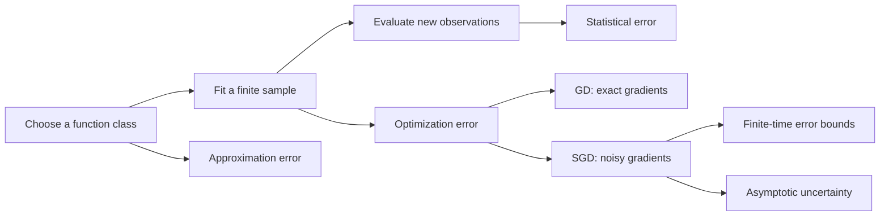

# 00 · How to use this course

[Home](../README.md) · [Next: risk](01-risk-and-representation.md)

## The connecting question

Learning has two different targets. The computer minimizes a loss calculated from available observations. The learner wants accurate predictions on future observations. A proof about the first target need not imply anything useful about the second without statistical assumptions.

The course follows this chain:

Use the diagram to locate a result before trying to memorize it. Double descent concerns prediction after fitting. A GD rate concerns numerical progress on a fixed objective. An SGD central limit theorem concerns scaled fluctuations around an optimizer. These answer different questions.

## A workable reading loop

For each chapter, write a one-sentence problem statement, identify the variables being held fixed, and reconstruct one proof on blank paper. Then solve the checkpoint. Only after that, read the solution. A useful study entry records the argument that can now be reproduced and the next verification task. It need not contain a transcript of how help was requested.

Use three passes:

1. **Meaning:** name the output and error. Is it training risk, test risk, a parameter norm, or a limiting distribution?
2. **Mechanism:** find the one-step equation. Most of the optimization chapter is about iterating a scalar inequality or telescoping a distance.
3. **Transfer:** change one assumption. Remove strong convexity, add noise, change initialization, or average the iterates. Locate the line that stops working.

## Prerequisite map

| If this is unfamiliar | Read before continuing |
|---|---|
| Gradient of a quadratic, eigenvalues, null space | [Notation and linear algebra](notation.md) |
| Conditional expectation | [Probability toolkit](10-probability.md), opening section |
| Why averaging changes variance | [Capacity](02-capacity-and-ridge.md) and [SGD](06-sgd.md) |
| Convergence in probability versus distribution | [Probability toolkit](10-probability.md) before Chapter 07 |

## What to learn actively

The foundational skills are deriving normal equations; completing a square; expanding a squared distance; applying conditional unbiasedness; recognizing a geometric recursion; and telescoping a sum. These are more reusable than a list of theorem numbers. The [proof playbook](../study/PROOF_PLAYBOOK.md) turns them into decision rules.

A suggested sequence is: Chapters 01–02; the scalar [worked example](../exercises/worked-example.md); Chapters 04–06; return to Chapter 03 with the matrix tools in place; read Chapter 10 before 07; finish with 08–09. Readers following the lecture order can instead use the chapter numbering directly.

There is no claim that a fixed schedule guarantees mastery. Advance when you can state the assumptions, derive the central step without looking, and explain a counterexample to an overbroad conclusion. The [learning ledger](../study/LEARNING_LOG.md) separates reading from this evidence.

## Three habits that prevent theorem overload

Write every rate as a full sentence: “For this output, under these assumptions, this quantity is at most this bound.” Keep a small example next to each general result. Finally, compare results only after matching the error metric: a bound on squared parameter error and a bound on parameter norm differ by a square root.

The later chapters are not prerequisites for understanding every earlier proof. In particular, confidence limits and stochastic orders can wait until the finite-time SGD recursions are comfortable.
